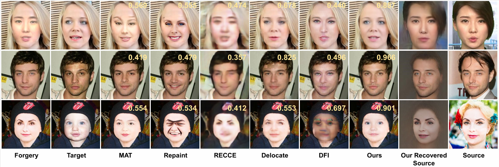
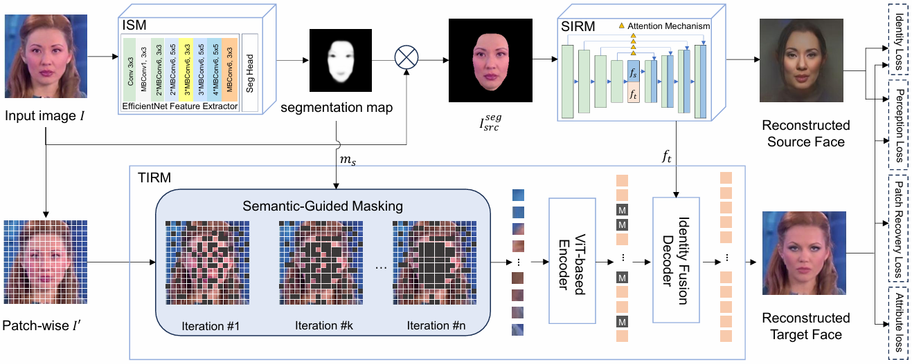

# DFREC &mdash; Official PyTorch Implementation



         

Official Implementation of [DFREC:DeepFake Identity Recovery Based on Identity-aware Masked Autoencoder](https://openreview.net/pdf?id=nxVUqDXJZG)

Recent advances in deepfake forensics have primarily focused on improving the classification accuracy and generalization performance. Despite enormous progress in detection accuracy across a wide variety of forgery algorithms, existing algorithms  lack intuitive interpretability and identity traceability to help with forensic investigation. In this work, we introduce a novel DeepFake Identity Recovery scheme (DFREC) to fill this gap. DFREC aims to recover the pair of source and target faces from a deepfake image to facilitate deepfake identity tracing and reduce the risk of deepfake attack. We evaluate DFREC on six different high-fidelity face-swapping attacks on FaceForensics++, CelebaMegaFS and FFHQ-E4S datasets, which demonstrate its superior recovery performance over state-of-the-art deepfake recovery algorithms.

## Inference
checkpoint path：https://drive.google.com/drive/folders/1ZXH-7QTy5P-o1zfhY7myUeTIhXUj_JmS?usp=sharing

To inference the DFREC, run this command:

```bash
#unzip the segmentation models codes
unzip segmentation_models.zip
#Prepare the environment required for the project
python -m pip install -r requirements.txt
#and then you can run the inference code
python DFREC_eval.py
```
## Training
The training code will be released after the paper is accepted.

## Implementation Author

Peipeng Yu @ Jinan University, Guangzhou, China. (ypp865@163.com)

## Paper Information

```bibtex
@article{yu2024dfrec,
  title={DFREC: DeepFake Identity Recovery Based on Identity-aware Masked Autoencoder},
  author={Yu, Peipeng and Gao, Hui and Huang, Zhitao and Xia, Zhihua and Chang, Chip-Hong},
  journal={arXiv preprint arXiv:2412.07260},
  year={2024}
}
```

